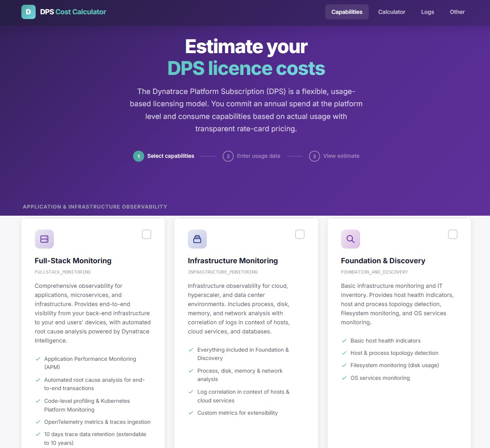

# DPS Cost Calculator

Dynatrace Platform Subscription (DPS) cost estimation calculator. Calculate your organization's DPS licensing costs based on actual usage patterns across multiple capabilities.

## Test version running as Github Page

[https://jonathanr79.github.io/DPS/](https://jonathanr79.github.io/DPS/)

## Getting Started

### Prerequisites

- Python 3.8 or later (for running the local development server)
- A modern web browser

### Available Pages

- **Capabilities** (`index.html`) - Browse and select DPS capabilities
- **Calculator** (`calculator.html`) - Estimate costs for Full-Stack Monitoring and related capabilities
- **Logs** (`logs.html`) - Calculate Log Management & Analytics costs
- **Other** (`other.html`) - Calculate costs for remaining capabilities (Security, Traces, Events, etc.)

## Features

- **Dynamic Price Loading**: All prices are fetched from `ratecard.json` for up-to-date rate card pricing
- **Interactive Calculators**: Real-time cost estimation with various usage parameters
- **Multi-Capability Support**: Calculate costs across 30+ DPS capabilities
- **Responsive Design**: Works on desktop and mobile browsers

## Rate Card Integration

Prices are centralized in `docs/ratecard.json`. All HTML pages dynamically load prices from this single source, ensuring consistency across the calculator.

The rate card data reflects the **public list prices in USD** from the [official Dynatrace pricing rate card](https://www.dynatrace.com/pricing/rate-card/). These are standard public prices and do not reflect any contractual or negotiated pricing.

### Updating Prices

To update pricing, simply edit the `docs/ratecard.json` file. All pages will automatically reflect the new prices on next page load.
